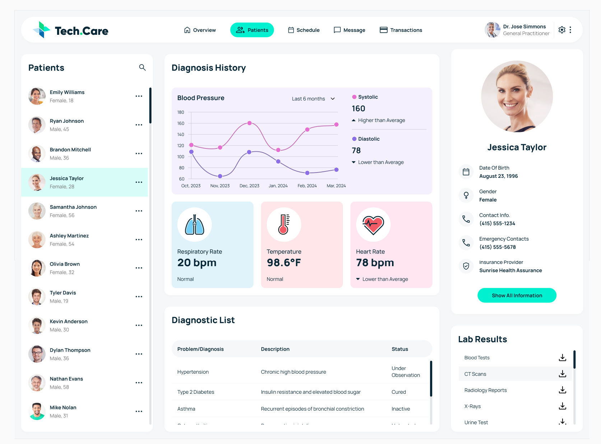

# Healthcare Dashboard

A modern healthcare dashboard built as a frontend development skill assessment for **Coalition Technologies**. Features dynamic patient management, data visualization, and API integration.
Visit https://healthcare-dashboard.apoorvdarshan.com for live preview.

## ✨ Features

- **Dynamic Patient Management** - Switch between patients with real-time updates
- **Interactive Charts** - Blood pressure visualization with Chart.js
- **Vital Signs Monitoring** - Live display of patient vitals
- **Responsive Design** - Works on desktop and mobile
- **API Integration** - Connected to Coalition Technologies test API

## 🛠️ Technologies

- HTML5, CSS3, JavaScript (ES6+)
- Chart.js for data visualization
- CSS Grid & Flexbox
- RESTful API with Basic Auth
- Google Fonts (Manrope)

## 🚀 Getting Started

1. Open `index.html` in your web browser
2. Dashboard loads patient data automatically from API
3. Click on different patients to see their information

**API Endpoint**: `https://fedskillstest.coalitiontechnologies.workers.dev`

## 🎯 Skills Demonstrated

- Modern frontend development (HTML5, CSS3, JavaScript)
- API integration with authentication
- Data visualization and interactive charts
- Responsive design and UI/UX
- Clean, maintainable code structure

---

_This project demonstrates frontend development capabilities including modern web technologies, API integration, data visualization, and professional UI design._
